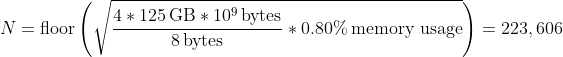

# How to Determine Problem Size N

Based on <https://icl.utk.edu/hpl/faq/index.html>
> What problem size (matrix dimension N) should I use?

Works for both single and multi-node.

In HPL, a matrix of size (N^2)*8 bytes is created, and we should be aiming to create a matrix that takes up 70%-90% memory. Double precision floating-point numbers (8 bytes) are used to represent data.

We can determine an appropriate value for the problem size N with the following equation:

<!-- > sqrt((memory in GiB/8 bytes) * [percent memory to use]) -->

![N=floor(sqrt((memory in GiB/8 bytes) * [percent memory to use]))](../images/problemsize.png)

The sqrt is there to make the problem size fit in the N x N matrix.

If the matrix is too big, performance can drop due to swapping. Furthermore, memory is still needed for other OS processes. If we use over 90% memory, the node may also go into a DOWN state.

As it is recommended for the problem size N to be a multiple of the block size NB, you can use this equation as a starting point, and then find the closest multiple of NB.

Here is an example using 4 nodes with 125 GB of memory each.

